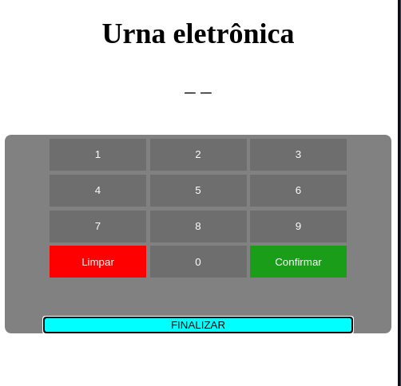

<h1>Urna Eletrônica - Web</h1>

Uma urna eletrônica feita com: 

<ul>
    <li>HTML5 </li>
    <li>CSS3 </li>
    <li>JavaScript </li>
</ul>

A urna contém 3 candidatos: 

<ul>
    <li>Candidato1 (45) </li>
    <li>Candidato2 (23) </li>
    <li>Candidato3 (15) </li>
</ul>

